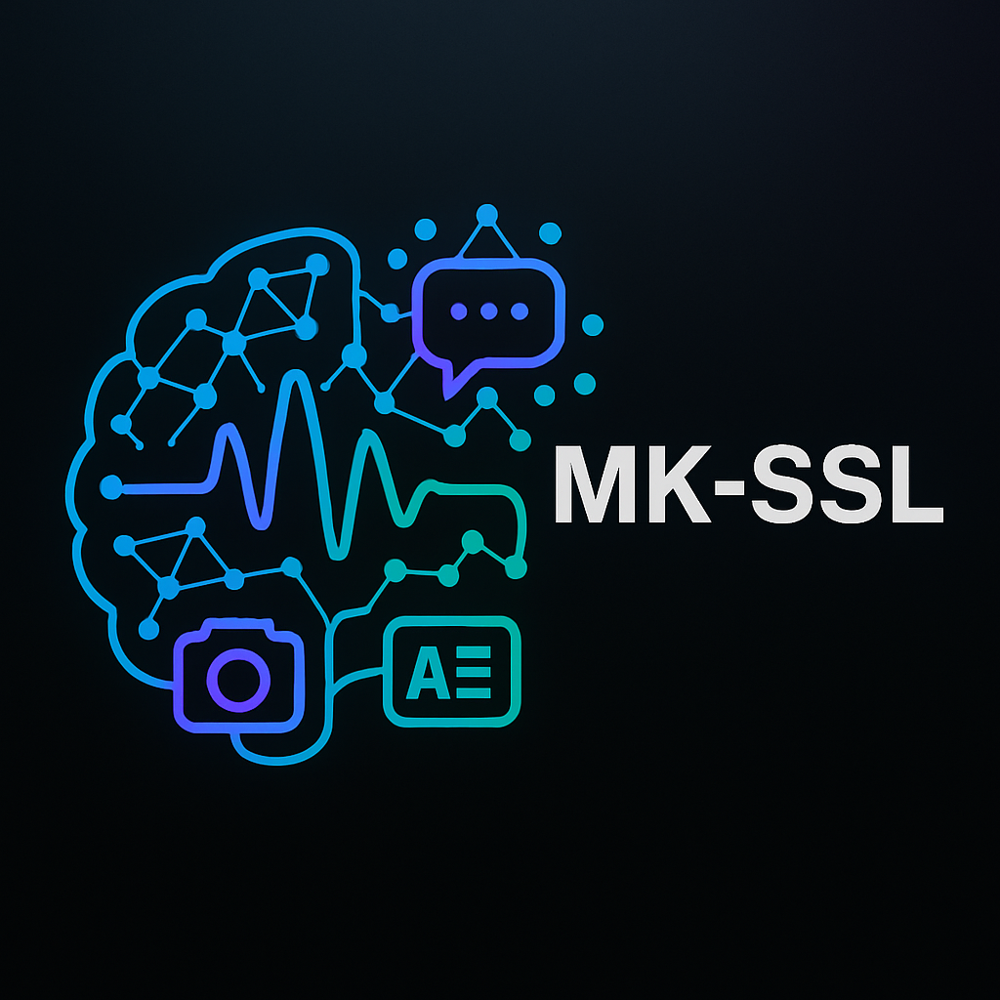

<p align="center">
  
</p>

<h1 align="center">
MK_SSL: A Modular Self-Supervised Learning Library for Audio, Vision, Graph, and Cross-Modal Data
</h1>

<p align="center">
  <em>Built with high-level APIs, integrated with HuggingFace, PyTorch Lightning, and state-of-the-art tools for self-supervised research.</em>
</p>

<p align="center">
  
  
  
</p>

---

## 📚 Table of Contents

* [📍 Overview](#-overview)
* [🧠 What is Self-Supervised Learning?](#-what-is-self-supervised-learning)
* [🚀 Supported Methods](#-supported-methods)
* [📦 Installation](#-installation)
* [🛠️ Usage Tutorial](#-usage-tutorial)
* [📊 Benchmarks](#-benchmarks)
* [🔧 Additional Tools Used](#-additional-tools-used)
* [🤝 Collaborators and Advisors](#-collaborators-and-advisors)
* [📜 License](#-license)

---

## 📍 Overview

Welcome to **MK\_SSL** — a versatile, high-level Python library tailored for self-supervised learning across audio, vision, graph, and multi-modal data. Whether you're training speech models from scratch, exploring masked image modeling, or aligning cross-modal representations for creative AI tasks, this library's got your back.

Inspired by practical research needs and real-world limitations, MK\_SSL gives you a clean and unified API to go from raw data to meaningful embeddings and evaluations — with minimal code and maximal control. HuggingFace integration? Check. DDP-ready? Absolutely. Easy switch between methods? Of course. Think of MK\_SSL as your command center for self-supervised experimentation.

---

## 🧠 What is Self-Supervised Learning?

Self-Supervised Learning (SSL) is the art of making machines teach themselves. Instead of relying on large annotated datasets, SSL derives learning signals directly from the structure of the input data. From predicting masked parts of audio or images to aligning different modalities — the goal is to extract high-quality representations that are meaningful, robust, and versatile.

MK\_SSL implements a rich variety of self-supervised techniques: contrastive, predictive, and reconstructive, all wrapped under one modular hood.

---

## 🚀 Supported Methods

### 🎧 Audio-based Methods

#### Wav2Vec2

Wav2Vec2 is a contrastive learning model that masks parts of an audio waveform and tries to predict them using latent representations. It has revolutionized self-supervised speech modeling, particularly for low-resource languages.

#### HuBERT

HuBERT builds on Wav2Vec2 by introducing k-means clustering on latent features to create pseudo-labels. These are then used as training targets, combining unsupervised and supervised elements for stronger representation learning.

#### SpeechSimCLR

This method adapts SimCLR-style contrastive learning to the speech domain. Using augmentations like speed perturbation and background noise, it learns to group similar-sounding audio while pushing apart dissimilar ones.

#### COLA

COLA (Contrastive Learning with Alignment) is designed for audio by combining contrastive objectives with temporal distance regression. It learns to embed utterances such that temporally closer ones are closer in representation space.

#### EAT

The Embedding Audio Transformer (EAT) borrows the masked autoencoding idea from vision transformers and applies it to spectrograms. The model learns to reconstruct masked portions of the audio signal with high fidelity.

---

### 🖼️ Vision-based Method

#### MAE (Masked AutoEncoder)

The Masked AutoEncoder masks random patches in an image and learns to reconstruct them. This method has shown incredible results in visual understanding, especially when pretraining large transformer-based encoders.

---

### 🧬 Graph-based Method

#### GraphCL

GraphCL brings contrastive learning to the world of graphs. It perturbs the structure of input graphs via augmentations like node dropping or edge masking, and learns to align their embeddings. It's especially powerful on chemical compounds and biological datasets.

---

### 🔀 Cross-Modal Methods

#### CLAP

CLAP trains on speech-text pairs and learns a joint embedding space where semantically related audio and text are close together. Useful for cross-modal retrieval or emotion detection.

#### AudioCLIP

This method generates audio samples from textual templates using Gemini-TTS and aligns them with CLIP-encoded image features. The result? A robust tri-modal alignment between text, image, and audio.

#### Wav2CLIP

Wav2CLIP maps raw audio into the CLIP embedding space. It uses frozen CLIP encoders and a learnable audio encoder to achieve surprisingly strong cross-modal alignment.

---

## 📦 Installation

```bash
pip install mk-ssl
```

---

## 🛠️ Usage Tutorial

Here’s how to go from zero to SSL hero with **MK\_SSL**. You can choose the ready-to-go Trainer classes, or bring your HuggingFace models and plug them into our framework.

### 🧩 Trainer Initialization (Audio Example)

```python
from MK_SSL.audio.Trainer import Trainer

trainer = Trainer(
    method = 'wav2vec2',
    backbone = None,
    save_dir = './',
    wandb_project = 'wav2vec2-pretext',
    wandb_mode = "online",
    use_data_parallel = True,
    checkpoint_interval = 5,
    verbose = True,
    reload_checkpoint=False,
    mixed_precision_training=False
)
```

### 🎯 Train the Model

```python
trainer.train(
    train_dataset=train_dataset,
    val_dataset=val_dataset,
    batch_size=16,
    epochs=100,
    lr=1e-4,
    weight_decay=1e-2,
    optimizer="adamw",
    use_hpo=True,
    n_trials=20,
    tuning_epochs=5,
    use_embedding_logger=True,
    logger_loader=logger_loader
)
```

### 🧪 Evaluate on Downstream Task

```python
trainer.evaluate(
    train_dataset=train_dataset,
    test_dataset=test_dataset,
    num_classes=39,
    batch_size=64,
    lr=1e-3,
    epochs=10,
    freeze_backbone=True
)
```

### 🧬 HuggingFace Example

```python
from transformers import BertForPreTraining, AutoTokenizer
model = BertForPreTraining.from_pretrained("bert-base-uncased")
tokenizer = AutoTokenizer.from_pretrained("bert-base-uncased")

trainer = GenericSSLTrainer(
    model=model,
    loss_fn=bert_loss_fn,
    dataloader=dataloader,
    optimizer_ctor=optimizer,
    epochs=10
)
trainer.fit()
```

---

## 📊 Benchmarks

### 🎧 Audio (Wav2Vec2 - TESS Emotion Dataset)


| Task        | Dataset | Model    | Accuracy |
| ----------- | ------- | -------- | -------- |
| Emotion Clf | TESS    | Wav2Vec2 | 92.1%    |

---

### 🔀 Cross-Modal (Wav2CLIP)


---

### 🖼️ Vision (MAE on CIFAR-10)

| Setting        | Accuracy |
| -------------- | -------- |
| Linear Probing | 79.2%    |
| Fine-tuned     | 84.6%    |

---

### 🧬 Graph (GraphCL)


| Dataset | Accuracy           |
| ------- | ------------------ |
| BBBP    | 70.4%              |
| Tox21   | 12-task avg: 75.8% |

---

## 🔧 Additional Tools Used


Beyond just training and evaluating, MK\_SSL packs a toolbox of extra powers:

* 🎯 **Hyperparameter Optimization (HPO)** — Automatic search with Optuna.
* 🧠 **LoRA Finetuning** — Efficient tuning of large models using fewer parameters.
* 🖥️ **Distributed Deep Learning (DDL)** — Train across multiple GPUs like a boss.
* 📊 **Live Monitoring with WandB** — Track, compare, and share your training sessions.
* 🎥 **Animated Embedding Logger** — Visualize how your representations evolve.
* 🧼 **Colored Logging System** — Pretty terminal logs with custom levels.
* 🤗 **HuggingFace Integration** — Use pre-trained transformers with ease.

These tools aren’t just bells and whistles — they make your research faster, cleaner, and more reproducible.

---

## 🤝 Collaborators and Advisors

* [Melika Shirian](https://github.com/MelikaShirian12)
* [Kianoosh Vadaei](https://github.com/kia-vadaei)

Advised by:

* [Dr. Peyman Adibi](https://scholar.google.com/citations?user=u-FQZMkAAAAJ)
* [Dr. Hossein Karshenas](https://scholar.google.com/citations?user=BjMFkWEAAAAJ)

---

## 📜 License

This project is released under the MIT License.
